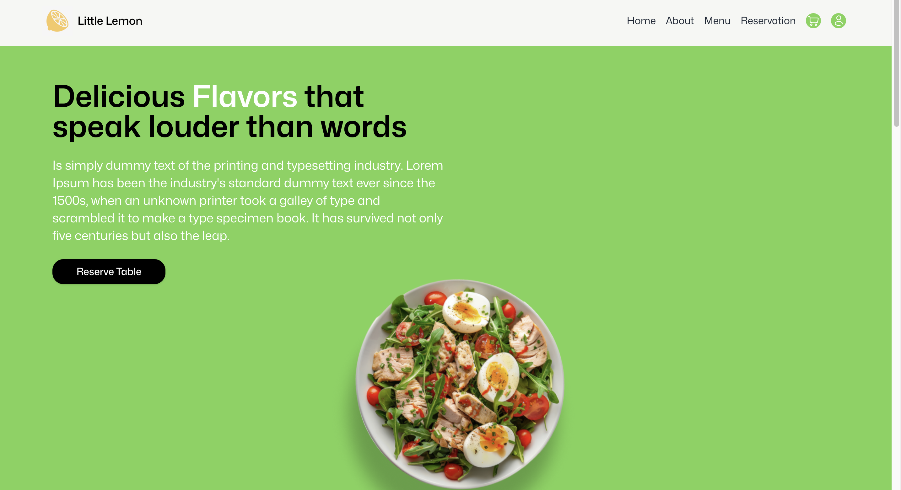
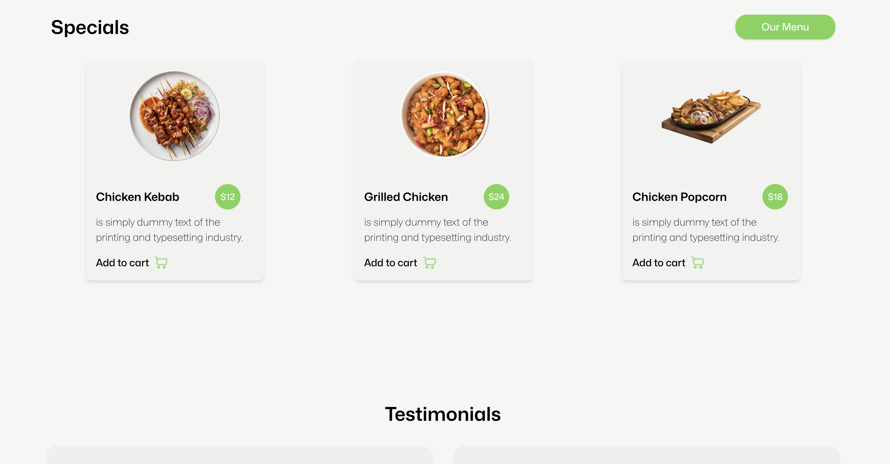
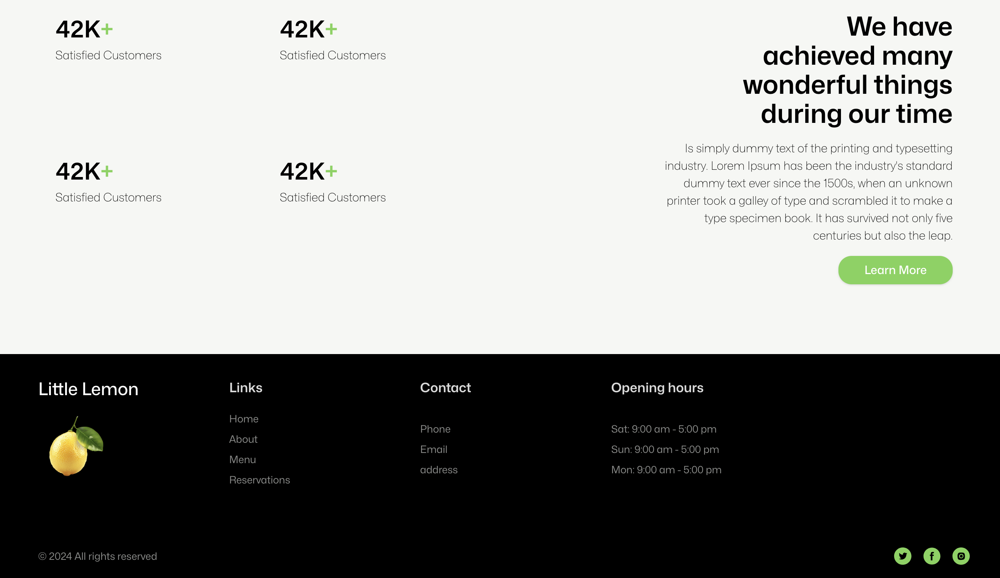
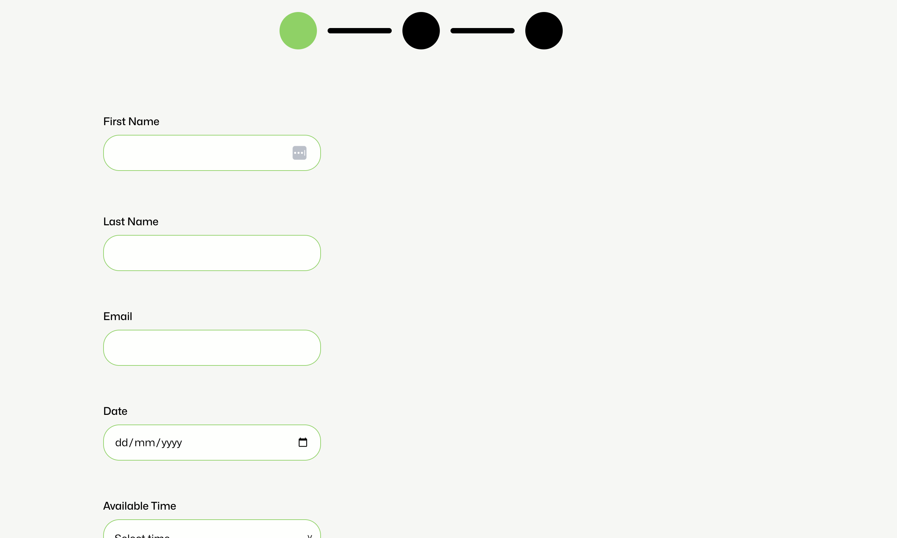

Book My Table

Book My Table is a web application that allows users to reserve tables at a restaurant. The application provides an easy-to-use interface for booking, and features a variety of menu items and specials. It is built with React and styled with Tailwind CSS.

Features

Table Booking: Users can fill out a form to book a table at the restaurant, including selecting a date, time, and location (indoor or outdoor).
Menu Display: The app displays a list of special menu items with descriptions, prices, and images.
Responsive Design: The layout adjusts for different screen sizes, providing an optimal user experience on both desktop and mobile devices.
Loading Skeletons: Placeholder skeletons are displayed while content is loading to improve perceived performance.
Image Optimization: Images are lazily loaded and optimized for faster loading times.

Technologies Used
React: A JavaScript library for building user interfaces.
Tailwind CSS: A utility-first CSS framework for rapid UI development.
React Router: A collection of navigational components for React applications.
Yup & Formik: Libraries for form validation and handling.
React Credit Cards: For displaying credit card previews.
React Skeleton: For displaying loading placeholders.

Installation
Clone the repository:
git clone https://github.com/yourusername/book-my-table.git

cd book-my-table

Install dependencies:
npm install --force

Run the application:
npm start

Open your browser and navigate to:
http://localhost:3000

Usage
Home Page: View the specials and click on "Our Menu" to see all menu items.
Booking: Click on "Reserve Table" in the hero section to navigate to the booking form.
Booking Form: Fill in the required details including name, email, date, time, and location. Click "Next" to proceed to the payment step.
Payment: Enter your credit card details to finalize the booking.

Customization
Styling: Modify the Tailwind CSS classes in the JSX files to change the styling.
Images: Add or replace images in the src/Images directory.
API Integration: Update src/Api/fetchAPI.js to connect to your backend or API service.
Contributing
Contributions are welcome! Please fork the repository and submit a pull request for review.

